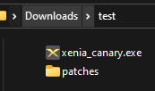

# Xenia Canary Game Patches
This repository contains game patches for [Xenia Canary](../../../../xenia-canary).\
Plugin documentation can be found [here](Plugin-Docs.md).

**Non-patch questions belong on the [Xenia Discord server](https://discord.gg/Q9mxZf9).**

[](https://discord.gg/fyRWq3xYNz)

### These are NOT actual games or Title Updates!<br>Read Xenia's [Quickstart](https://github.com/xenia-canary/xenia-canary/wiki/Quickstart) to get games.

## Installing/Updating
0. Prerequisites
    * [Latest Xenia Canary experimental](https://github.com/xenia-canary/xenia-canary/releases/download/experimental/xenia_canary.zip).
        * Patches aren't supported on master or outdated versions of Xenia Canary.
1. Download [this zip](../../../releases/latest/download/game-patches.zip).
2. Go to where `xenia_canary.exe` is.
3. Delete `patches` folder if present (backup if needed).
4. Open `game-patches.zip` and extract `patches` in the same directory as `xenia_canary.exe`.
    The folder structure should look like this:
<br>
    ```
    └─── Xenia Canary
        |  ...
        │  xenia_canary.exe
        |  ...
        └─── patches
                ...
                584111F7 - Minecraft (XBLA, TU0).patch.toml
                ...
    ```
5. Continue to the section below.

## How to use
0. Prerequisites
    * [Latest Xenia Canary experimental](https://github.com/xenia-canary/xenia-canary/releases/download/experimental/xenia_canary.zip)
        * Patches aren't supported on master or outdated versions of Xenia Canary.
    * The right version of the game e.g. Title Update (TU).
    <!--
        * Try commenting out the `hash` of the patch like so:
            ```toml
            # Add # before hash
            hash = "################"
            # like this
            #hash = "################"
            ```
            **This isn't guaranteed to work, and may cause crashes.**
            <br>Hashes are used to verify the correct version of a game is being patched, and this bypasses it.
            <br><br>If the game has multiple modules you will need to [get the hash(es)](#How-to-get-the-module-hash-and-filename)
    -->
    * `apply_patches` set to `true` (default) in the [Xenia Canary config](https://github.com/xenia-canary/xenia-canary/wiki/Options#canary).
1. Open the .patch.toml file that corresponds to your game in a text editor (Notepad, [VSCode](https://code.visualstudio.com/), [VSCodium](https://vscodium.com/), [Notepad++](https://notepad-plus-plus.org/), etc.)
2. Change `is_enabled` from `false` to `true`. For example, to enable a 60 FPS patch:
    ```toml
    [[patch]]
        name = "60 FPS"
        desc = "Description"
        author = "Author"
        is_enabled = false

        [[patch.be8]]
            address = 0x########
            value = 0x##
    ```
    becomes
    ```toml
    [[patch]]
        name = "60 FPS"
        desc = "Description"
        author = "Author"
        is_enabled = true

        [[patch.be8]]
            address = 0x########
            value = 0x##
    ```

If you see `[Patches Applied]` in the title bar then the patch(es) applied successfully.

***Don't change the hash of existing patches. If your version of the game is different then the patch(es) need to be ported to that version.***

#### Notes about aspect ratio patches
* [**`present_letterbox` must be changed from `true` to `false`!**](https://github.com/xenia-canary/xenia-canary/wiki/Options#black-bars-letterboxingpillarboxing)
* Aspect ratio patches **do not** increase resolution!
* While most aspect ratio patches are 21:9 (3440/1440), they can be changed to other aspect ratios as well unless not specified or specified otherwise;
    1. Divide your monitor's resolution width by height (i.e. 3440/1440)
    2. [Convert the result to hex](https://gregstoll.com/~gregstoll/floattohex).
    3. Change the value to `0x########` replacing `########` with the hex value.

#### Note about framerate patches
Framerates above 60 FPS require [vsync to be changed from true to false in the Xenia Canary config](https://github.com/xenia-canary/xenia-canary/wiki/Options#user-content-Vsync).

---

## Setting up Cheat Engine
* Memory Breakpoints can be set in Cheat Engine or MSVC with [`emit_source_annotations = true`](https://github.com/xenia-canary/xenia-canary/wiki/Options). This will give annotations in disassembly.
* Cheat Engine 7.2+ includes Big Endian types, but they must be enabled;
  * Click `Edit` > `Options` > `Extra Custom Types` and check all of them.
* Go to `Scan Settings` and enable `MEM_MAPPED`.
* Change 'Memory Scan Options' to:
  |     | All
  ----- | :----------
  Start | `100000000`
  Stop  | `200000000`
  * This may change depending on the programs you have running.
* Once you find a value you can attach Cheat Engine's debugger to see what reads/writes to that address.
<br>This will show an xex address when a breakpoint is hit, although there is currently no way to set a breakpoint on execution within the Xenia Debugger.

## Creating a patch
### Prerequisites
* [Cheat Engine](https://www.cheatengine.org)
  * See [setting up Cheat Engine](#Setting-up-Cheat-Engine)
* [Ghidra](https://ghidra-sre.org/)
  * [XEX Loader](https://github.com/zeroKilo/XEXLoaderWV/releases)
* [IDA Pro](https://hex-rays.com/ida-pro/)
  * [IDA 7 XEX Loader](https://github.com/emoose/idaxex)
  * [IDA 6 XEX Loader](https://xorloser.com/blog/?p=395)
* Text editors:
  * [Visual Studio Code](https://code.visualstudio.com/)
  * [VSCodium](https://vscodium.com/)
  * [Notepad++](https://notepad-plus-plus.org/)
* Recommended but optional:
  * [ESLint TOML plugin](https://ota-meshi.github.io/eslint-plugin-toml/user-guide/#installation)
    * See [Editor Integrations](https://ota-meshi.github.io/eslint-plugin-toml/user-guide/#editor-integrations)
  * Visual Studio Code/VSCodium extensions:
    * [Even Better TOML](https://marketplace.visualstudio.com/items?itemName=tamasfe.even-better-toml)
  * To make things easier, put Xenia Canary in the directory that contains `/patches` and run it with [`portable.txt`](https://github.com/xenia-project/xenia/wiki/Options#how-to-use).

### Guidelines
* Patch must be named `Title ID - Game Title.patch.toml` and be in `/patches`.
<br>For example, a patch file for Blue Dragon must be called `4D5307DF - Blue Dragon.patch.toml`.
* If you are making a patch for a game that already has a file, then add to it*
  * Only exception being if you're patching a different module.
* Submitting patches:
  * No whitespace.
  * Lowercase hex for address/value hex, uppercase for title ID/hash/media ID.

### How to get the module hash and filename:
0. ***Don't change the hash of existing patches. If your version of the game is different then the patch(es) need to be ported to that version.***
1. Set [`log_level`](https://github.com/xenia-canary/xenia-canary/wiki/Options) to at least [`2` (default)](https://github.com/xenia-canary/xenia-canary/wiki/Options) in the Xenia Canary config; See [How to use](https://github.com/xenia-canary/xenia-canary/wiki/Options#how-to-use) for location.
2. Run the game at least once.
3. Close Xenia Canary.
4. Obtain module hash/title ID/title name;
    * Search <kbd>Ctrl+F</kbd> for `Module hash:` in `xenia.log`
    <br>You should see something like:
      ```
      i> ######## Module \Device\Cdrom0\default.xex:
      Module Hash: ################
      ```
    * Patches can have multiple executables/hashes. Only leave the hash(es) you're using uncommented:
      https://github.com/xenia-canary/game-patches/blob/95f51801048dc6e95675581e3fcf8fcdfc3e5544/patches/454108D8%20-%20Army%20of%20Two%20The%2040th%20Day.patch.toml#L3-L6

### Patch types
`[[patch.*]]` | Info           | Value (example)
------------: | :--:           | ---------------
`be8`         | Hex, 1 byte    | `0x00`
`be16`        | Hex, 2 bytes   | `0x0000`
`be32`        | Hex, 4 bytes   | `0x00000000`
`be64`        | Hex, 8 bytes   | `0x0000000000000000`
`array`       | Hex, any size  | `"0x##*"`
`f32`         | Float, single  | `1.0`
`f64`         | Float, double  | `1.0`
`string`      | String, UTF-8  | `"string"`
`u16string`   | String, UTF-16 | `"string"`

### Example patch
```toml
title_name = "Game Title"
title_id = "1234ABCD" # AB-1234
hash = "################" # Module the hash applies to (i.e. default.xex)
          # Can be an array if applicable:
hash = [
  "################"     # See above
]
#media_id = "1234ABCD" # Optionally you can add a redump link; Disc (Region): http://redump.org/disc/1234
#                        Can also be an array if applicable:
#media_id = [
#  "1234ABCD"          # See above
#]
# Title ID, hash, and media ID must be uppercase.

[[patch]]
  name = "Patch name"
  author = "Me"
  desc = "Patch description" # Description is optional
  is_enabled = false         # Must be false for PRs

# [[patch.*]]
#  For example, be8:
  [[patch.be8]]
    address = 0x82000000 # Tends to start with 0x8, always 4 bytes
    value = 0x00
#  Address and value hex must be lowercase.
#   string:
  [[patch.string]]
    address = 0x82000000 # Tends to start with 0x8, always 4 bytes
    value = "string"
# End of file newline
```
